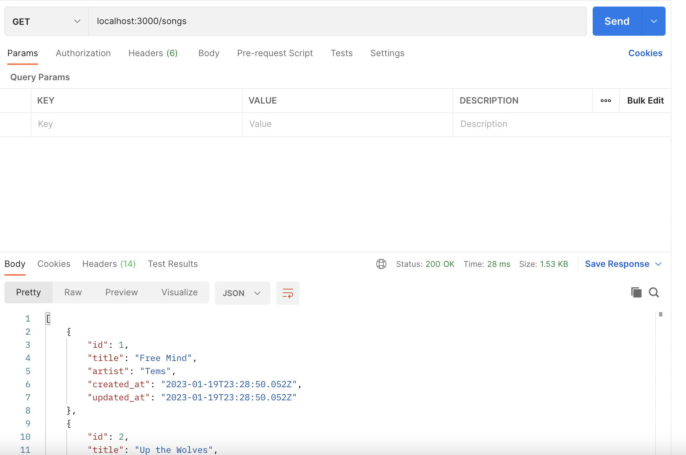
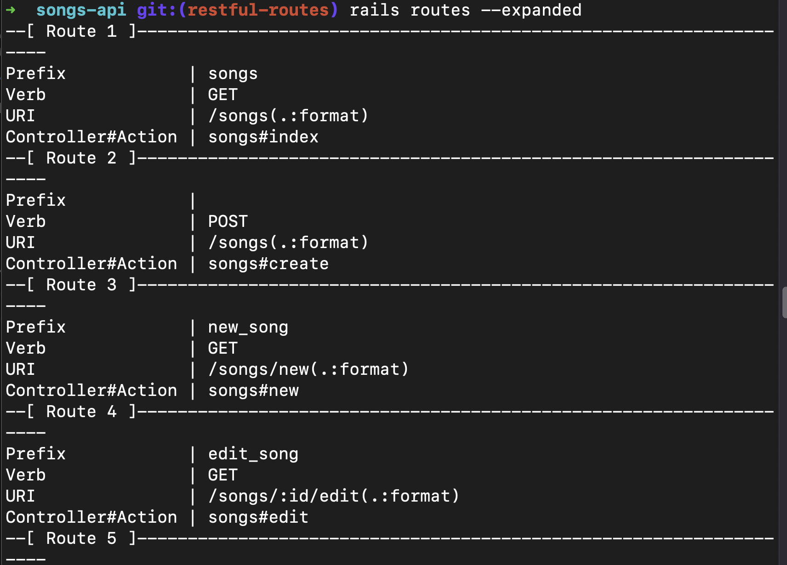
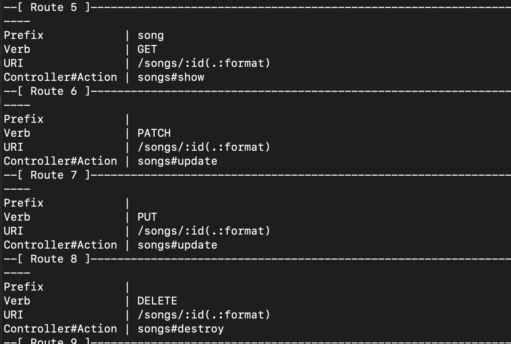
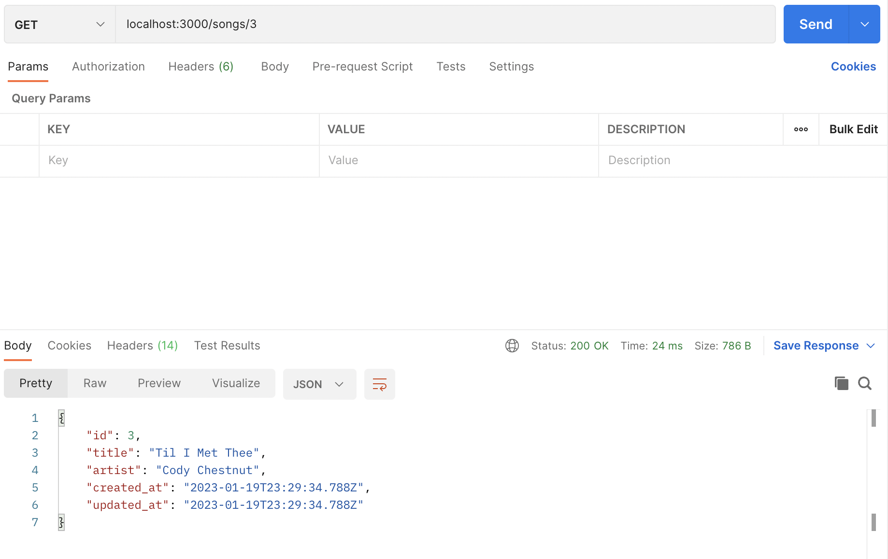
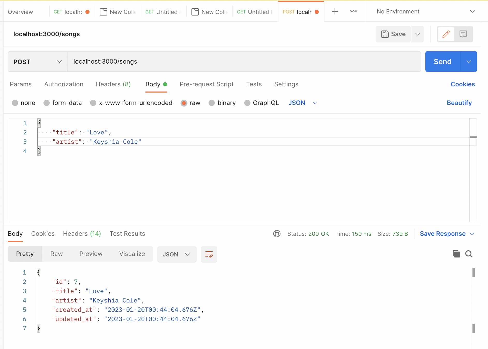

## Rails API with Postman - 1/19/23 Hotel

### Adding rails app to empty github repo
- $ rails new <app_name> -d postgresql -T
- $ cd <app_name>
- $ rails db:create
- $ git remote add origin https://github.com/learn-academy-2022-hotel/wildlife-tracker-SunkissedQueen.git
- $ git status
- $ git checkout -b main
- $ git add .
- $ git commit -m "initial commit"
- $ git push origin main

### branch: initial-setup
- checkout a new branch: initial-setup

- API: delivers data in a json, allows different programs to connect

- Restful routes that deal solely with data: create, update, index, destroy, show. These are also known as rails endpoints. 

```bash
SPECIAL NOTE
If you should need to destroy a method/controller, there is a rails destroy command. `rails destroy` or `rails d`
Example of the structure of that command:
  - $ rails d resource Song title:string artist:string
Remember to drop and recreate the database
  - $ rails db:drop
  - $ rails db:create
```

Add rspec dependencies and files
- $ bundle add rspec-rails
- $ rails generate rspec:install

Start the server
- $ rails s

Create a song tracker. 
  - model for the songs
  - controller 
  - $ rails g resource Song title:string artist:string
    - generating a resource creates a model and controller for Song
    - by adding rspec dependencies and files before the resource, it will automatically create test files for the model (spec/models/song_spec.rb) and the controller (spec/requests/songs_spec.rb)

Update the schema
- $ rails db:migrate

Make data entry
- $ rails console 

To see all entries in the database
  > Song.all

To make entries in the database
  > Song.create(title:'Free Mind', artist:'Tems') 

  > Song.create(title:'Up the Wolves', artist:'The Mountain Goats')

  > Song.create(title:'Til I Met Thee', artist:'Cody Chestnut')

  > Song.create(title:'Everyone Wants to Rule the World', artist:'Tears for Fears')

Push changes to github and delete the stale branches remotely and locally

### branch: restful-routes

- checkout a new branch: resftul-routes

### Process
- modify the controller method
- verify that it works in postman

- Postman - data visualization tool, make a request and show a response

INDEX ENPOINT
- apps/controller
```ruby
  def index
    songs = Song.all
    render json: songs
  end
```
- Postman
  
  - http verb, path, click send

    `GET localhost:3000/songs`
  - Output: array of objects containing our data entries

  SPECIAL NOTE
  - use the rails routes command as a resource to making requests
  
  
  

SHOW ENDPOINT
```ruby
  def show
    song = Song.find(params[:id])
    render json: song
  end
```
- Postman
  
  - http verb, path, click send

    `GET localhost:3000/songs/3`
  - Output: object containing the data entry at the id given

  CREATE ENDPOINT 
  - strong params: provide control over the data entered into our db, protect what is being shared
  - private is a keyword that provides security to the strong params
  ```ruby
    def create
      song = Song.create(song_params)
      if song.valid?
        render json: song
      else
        render json: song.errors
      end
    end

    private
    def song_params
      params.require(:song).permit(:title, :artist)
    end
  ```
- Postman
  
  - steps for making a create request
    - http verb, path

      `POST localhost:3000/songs`
    - select the radio buttons: body, raw
    - select JSON from the dropdown menu
    - Add an object containing the key:value pairs for valid entries
    ```json
      {
        "title": "Love",
        "artist": "Keyshia Cole"
      }
    ```
    - click send
  - Output: object containing the data entry at the id given 

  SPECIAL NOTE
  - if there is html in the body output, go to the preview to see the error message 

    `Can't verify CSRF token authenticity.`
  
  - add the following code inside the ApplicationController
    - app/controllers/application_controller.rb
    ```ruby
      skip_before_action :verify_authenticity_token
    ```

